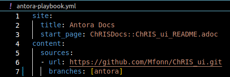
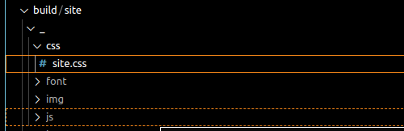
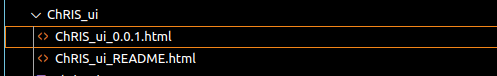
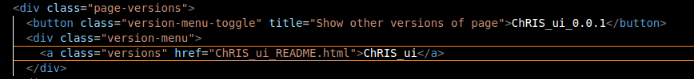

# The published site of the ChRIS documentation is hosted at: https://mfonn.github.io/CHRIS_docs/

## CONVERTING MARKDOWN TO ADOC

Markdown is a plain text formatting syntax aimed at making writing for the internet easier. The philosophy behind Markdown is that plain text documents should be readable without tags complicating them, however there should still be ways to add text modifiers like lists, headings, italics and the like.
AsciiDoc is a lightweight markup language that is used as a tool for generating software documentation. One of its advantage over markdown is the ability to leverage directives 


AsciiDoc is a lightweight markup language that is used as a popular tool for generating any type of software documentation. The AsciiDoc syntax is readable, concise, comprehensive, extensible, and extremely intuitive. One of the core advantages of using AsciiDoc is the ability to leverage include directives. Since this is a native feature of AsciiDoc, writers and developers alike can single-source content much like a React component. Rather than updating the same content in multiple places, writers simply have a source file that is included where necessary, and changes cascade to all locations.


The ChRIS documentation is written using markdown, in other to convert to asciidoc: 
  - Install asciidoctor, Asciidoctor is a Ruby-based text processor for parsing asciidoc into a document model and converting it to output format such as html. 
  
  `sudo apt-get install -y asciidoctor`

## Installing Kramdown
  - Install kramdown <br>
  `sudo gem install kramdown-asciidoc` <br>
  - Convert the markdown file to adoc using the syntax:
    ```
    kramdoc --format=GFM \ 
      --output=FILENAME.adoc \ 
      --wrap=ventilate \ 
      FILENAME.md
      ``` 
      
      
  ## To open the page on your local host using
  - Clone the repository, antora branch using 
  ```
  git clone -b  antora  <link to repository>
  ``` 
  
  In this case it will be:
  
  ```
  git clone -b antora https://github.com/Mfonn/CHRIS_docs.git
  ```
  
  - cd into the repository
  - Install Antora and required packages 
     ```
     node -e "fs.writeFileSync('package.json', '{}')" && npm i -D -E @antora/cli@3.0 @antora/site-generator@3.0
     
     ```
  - confirm the following files are present: 
      -antora-playbook.yml
      -antora.yml
  - Run `npx antora --fetch antora-playbook.yml`
  - It should say, "Site generation completed" 
  - Open the link generated in your browser


## FOR MULTIPLE REPOSITORIES (STEPS I USED TO CREATE MULTIPLE REPOSITORIES)
- clone the repository locally

 ```
 git clone -b antora https://github.com/Mfonn/CHRIS_docs.git
 ```
 
 
- install asciidoc

  ```
  sudo apt-get install -y asciidoctor
  ```

- changed markdown to adoc using kramdown

   ``` 
   kramdoc --format=GFM \ 
      --output=FILENAME.adoc \ 
      --wrap=ventilate \ 
      FILENAME.md
      ``` 
      

- install antora

  ```
  node -e "fs.writeFileSync('package.json', '{}')" && npm i -D -E @antora/cli@3.0 @antora/site-generator@3.0
  ```
  
- create antora-playbook.yml file and the antora.yml file using the syntax in the documentation. <br> 
[Link to antora playbook syntax](https://docs.antora.org/antora/latest/playbook/set-up-playbook/)

- In the main folder, create the following folders a `pages` folder contained in a `root` folder which is contained in a `modules` folder.


- In the pages folder add the .adoc file 


- push your changes to your github repository

- add the url of the repository you pushed the changes to the antora playbook.yml




## Styling The Antora Pages

The Antora pages are hosted on github pages and the css is gotten from one folder. When building the site, antora creates a site.css file where all the css is hosted. Editing this file, edits the css of the page. 




## Versioning the Antora Pages

Antora has a feature that allows both past and present versions of a page to be available. <br>
To add a new version, in the `github pages` branch, in the ChRIS docs folder, create a new file containing the changes.


In the html, add a link to the new version. 


